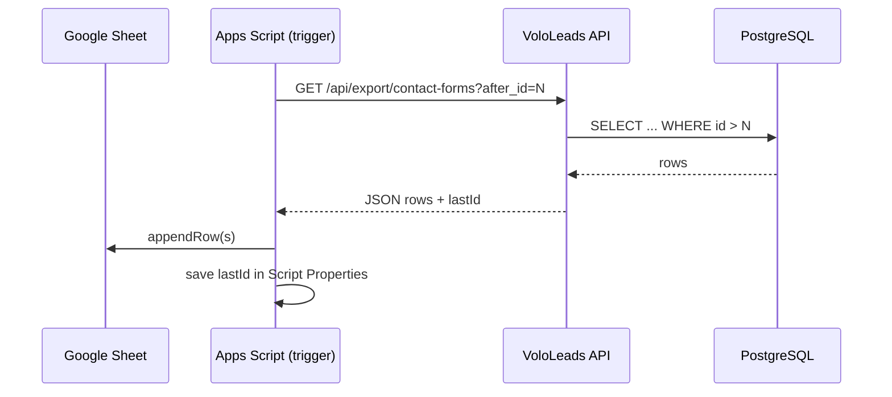

# Google Sheets sync (PostgreSQL → Sheet)

VoloLeads stores data in **PostgreSQL**. Google Apps Script cannot reliably connect to a cPanel/private Postgres host, so sync goes through your **Node API** instead of direct SQL from the sheet.

## Flow



## 1. Backend

Set a long random secret in production `.env`:

```env
SHEETS_SYNC_API_KEY=your-long-random-secret
```

Endpoints (require `Authorization: Bearer <key>` or header `X-Sync-Api-Key`):

| Endpoint | Purpose |
|----------|---------|
| `GET /api/export/contact-forms?after_id=0&limit=500` | Contact form leads |
| `GET /api/export/subscriptions?after_id=0&limit=500` | Stripe subscriptions |

- `after_id=0` — full initial import (oldest → newest by `id`)
- Next runs — pass the last saved `id` so only **new** rows are returned
- `hasMore: true` — call again with updated `after_id` until false (handled in the bundled script)

## 2. Google Sheet + Apps Script

1. Create a spreadsheet (e.g. “VoloLeads CRM”).
2. **Extensions → Apps Script** — copy `backend/scripts/google-sheets-sync.gs`.
3. Run **`setupScriptProperties()`** once; set `API_BASE_URL` (your live API, no trailing slash) and `SYNC_API_KEY` (same as server).
4. Run **`syncAll()`** once for the first import.
5. **Triggers** → Add trigger → `syncAll` → Time-driven (every 5–15 minutes).

Script Properties store `contact_forms_last_id` and `subscriptions_last_id` so scheduled runs only append new rows.

## 3. Security notes

- Do not put the database URL in Apps Script.
- Rotate `SHEETS_SYNC_API_KEY` if it leaks.
- Existing `GET /api/contact-forms` is still unauthenticated; use the export routes for automation and consider locking down admin reads separately.

## 4. Visitor events

`visitor_events` can be high volume. If you need them in Sheets, add a similar `findAfterId` + export route or aggregate in SQL before export.
